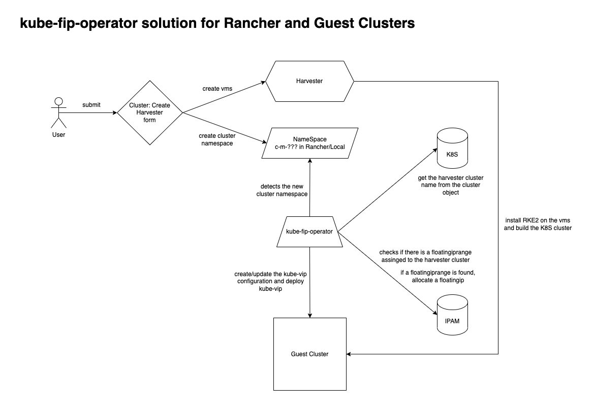

# kube-fip-operator

The kube-fip-operator application manages the FloatingIP and FloatingIPRange Custom Resource Definition objects in a Rancher environment and also takes care of the installation/configuration of kube-vip in the guest clusters. The [kube-vip](https://kube-vip.io/) application will use the assigned floating ip address and activates it when a Service of the type Loadbalancer is created. The main purpose for this is that every Rancher guest cluster has an ip address available for a ingress service.

## Use case

The following image gives an overview about the use case of the kube-fip-operator:



## How does the operator work?

The following image describes how the kube-fip-operator works internally:


## Creating the Kubernetes Custom Resource Definitions (CRDs)

Execute the crd yaml file which is located in the template directory, for example:

```SH
kubectl create -f deployments/crds.yaml
```

## Building the container

There is a Dockerfile in the current directory which can be used to build the container, for example:

```SH
[docker|podman] build -t <DOCKER REGISTRY URI>/kube-fip-operator:latest .
```

Then push it to the remote container registry target, for example:

```SH
[docker|podman] push  <DOCKER REGISTRY URI>/kube-fip-operator:latest
```

## Deploying the container in Rancher

Use the deployment.yaml template which is located in the templates directory, for example:

```SH
kubectl create -f deployments/deployment.yaml
```

Before executing the above command, edit the deployment.yaml and set the proper image source:
```YAML
spec:
  [..]
  template:
    [..]
    spec:
      containers:
      - name: kube-fip-operator
        image: <DOCKER REGISTRY URI>/kube-fip-operator:latest
```

The following options can be set in the kube-fip-config ConfigMap:

**logLevel**
```YAML
option: logLevel
values: Info, Debug, Warn, Error, Fatal, Panic or Trace
description: Set the program loglevel.
```

**operateGuestClusterInterval**
```YAML
option: operateGuestClusterInterval
value: <integer> (in seconds)
description: This specifies the interval when the guest cluster operations are running.
```

**traceIpamData**
```YAML
option: traceIpamData
value: true, false
description: If this option is enabled the ipam data will be logged everytime the operate guest functions are done (handy for debugging and consistancy checking).
```

**kubevipGuestInstall**
```YAML
option: kubevipGuestInstall
value: enabled (deploy in every cluster), disabled (don't deploy), clusterlabel (looks for the kube-vip=true label in the cluster object)
default value: clusterlabel
description: Automatically deploys the kube-vip and kube-vip-cloud-provider helm charts
```

**kubevipUpdate**
```YAML
option: kubevipUpdate
value: true, false
default value: false
description: If this option is enabled, the kube-vip and kube-vip-cloud-provider will be updated at every "operateGuestClusterInterval" (handy for mass updating all the guest clusters).
```

**kubevipNamespace**
```YAML
option: kubevipNamespace
value: <namespace name>
default value: kube-system
description: The name of the NameSpace where kube-vip should be deployed.
```

**kubevipChartRepoUrl**
```YAML
option: kubevipChartRepoUrl
value: <Kube-Vip Helm Chart URL>
default value: "https://kube-vip.io/helm-charts"
description: This specifies the Kube-Vip Helm Chart URL.
```

**kubevipChartValues**
```YAML
option: kubevipChartValues:
value: <Helm Chart values.yaml content>
default value: |
  config:
    vip_interface: enp1s0
  image:
    repository: plndr/kube-vip
    tag: v0.3.7
  nodeSelector:
    node-role.kubernetes.io/master: 'true'
description: This specifies the Helm Chart values (in yaml format) for deploying Kube-Vip.
```

**kubevipCloudProviderChartValues**
```YAML
option: kubevipCloudProviderChartValues
value: <Helm Chart values.yaml content>
default value: |
  image:
    repository: kubevip/kube-vip-cloud-provider
    tag: 0.1
description: This specifies the Helm Chart values (in yaml format) for deploying the Kube-Vip Cloud Provider.
```

**removeHarvesterCloudProvider**
```YAML
option: removeHarvesterCloudProvider
value: true, false
default value: true
description: If this option is enabled, the harvester-cloud-provider will be removed from the Guest cluster when kube-vip is enabled/installed.
```


**harvesterCloudProviderNamespace**
```YAML
option: harvesterCloudProviderNamespace
value: <namespace name>
default value: kube-system
description: The name of the NameSpace where the harvester-cloud-provider helm chart is deployed.
```


## Usage

### Creating a Floating IP Range object

The following yaml/command can be used to create a new FloatingIPRange object:

```SH
(
cat <<EOF
apiVersion: kubefip.k8s.binbash.org/v1
kind: FloatingIPRange
metadata:
  annotations:
    harvesterClusterName: harvester-cluster1
    harvesterNetworkName: vlan10
  name: guest-vlan
spec:
  iprange: 10.135.10.192/26
EOF
) | kubectl create -f -
```

Object explanation:

<li> The harvesterClusterName annotation is related to a Rancher "Harvester Cluster". This is used by the program to tie it to a certain location.
<li>The harvesterNetworkName annotation is related to the Harvester cloud provider network of the cluster. This is used to match a certain network name if the Harvester cloud provider has multiple networks configured.
<li>The IP range/cidr needs to be configured in the spec.iprange.


### Creating a Floating IP object

FloatingIP objects are automatically created when there is a new cluster created. This is done by the event watcher mechanism which monitors on new cluster namespaces starting with "c-m-". When such a new namespace is found, the kube-fip-operator will detect which FloatingIPRange object is tied to the used Harvester cluster and then creates the FloatingIP object for the new cluster. Allocating FloatingIP objects can also be done manually by using the examples below. It's also possible to assign previously used ip addresses to a certian cluster by updating the FloatingIP object of the cluster and replace the ipaddress in the spec.

The following yaml/command can be used to create a new FloatingIP object with a static ip address assigned:

```SH
(
cat <<EOF
apiVersion: kubefip.k8s.binbash.org/v1
kind: FloatingIP
metadata:
  name: demo-vip
  namespace: c-m-ngd5hs2r
  annotations:
    clustername: demo
    fiprange: guest-vlan
    updateConfigMap: "true"
spec:
  ipaddress: 10.135.10.200
EOF
) | kubectl create -f -
```

And the following yaml/command can be used to create a new FloatingIP object with a dynamic ip address assigned:

```SH
(
cat <<EOF
apiVersion: kubefip.k8s.binbash.org/v1
kind: FloatingIP
metadata:
  name: demo-vip
  namespace: c-m-ngd5hs2r
  annotations:
    clustername: demo
    fiprange: guest-vlan
    updateConfigMap: "false"
spec: {}
EOF
) | kubectl create -f -
```

The last option is also used when a new cluster is detected.

Object explanation:

<li>The namespace field is related to the cluster namespace.
<li>The clustername annotation is related to the actual name of the cluster.
<li>The fiprange annotation is related to a FloatingIPRange object. This means that the FloatingIP will be allocated from that pool.
<li>When the updateConfigMap annotation is set to "true" it will update the kube-vip ConfigMap at every guest cluster operation interval.
<li>If the spec.ipaddress field is set, that ip will be allocated in the pool if it's free. If the ipaddress object field in the spec is not set, it will automatically allocate a free ip address in the pool and sets it in the FloatingIP object.

# License

Copyright (c) 2021 Joey Loman <joey@binbash.org>

Licensed under the Apache License, Version 2.0 (the "License");
you may not use this file except in compliance with the License.
You may obtain a copy of the License at

[http://www.apache.org/licenses/LICENSE-2.0](http://www.apache.org/licenses/LICENSE-2.0)

Unless required by applicable law or agreed to in writing, software
distributed under the License is distributed on an "AS IS" BASIS,
WITHOUT WARRANTIES OR CONDITIONS OF ANY KIND, either express or implied.
See the License for the specific language governing permissions and
limitations under the License.